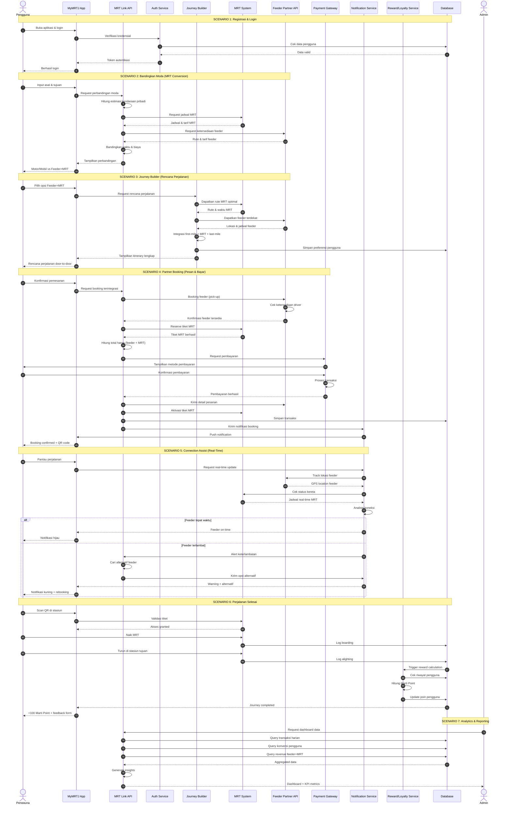

# MyMRTJ Ecosystem - End-to-End Sequence Diagram Preview

[](https://abdhaamed.github.io/mrt-sequence/)
[](https://jakartamrt.co.id/)
[](https://lucide.dev/)
[](https://mermaid.js.org/)

Halaman web preview interaktif untuk **Sequence Diagram End-to-End Ekosistem MyMRTJ (MRT Jakarta)**. Dirancang khusus untuk memvisualisasikan seluruh alur transaksi terpadu end-to-end secara jelas dan terpusat tanpa distraksi.

🔗 **Akses Preview Web (GitHub Pages):**  
👉 **[https://abdhaamed.github.io/mrt-sequence/](https://abdhaamed.github.io/mrt-sequence/)**

---

## Fitur Preview

- **Tampilan End-to-End Penuh**: Memvisualisasikan seluruh 7 skenario interaksi dalam satu alur utuh.
- **Pan & Zoom Canvas**: Memperbesar, memperkecil, dan menggeser canvas diagram dengan mulus.
- **Unduh Format Vektor & Gambar**: Ekspor diagram langsung ke format **SVG** atau **PNG** resolusi tinggi.
- **Salin Kode Mermaid**: Menyalin kode sumber diagram dengan satu klik.
- **Layar Penuh (Fullscreen)**: Mode presentasi layar penuh.

---

## Sequence Diagram End-to-End



---

## 7 Skenario yang Dicakup

1. **Registrasi & Login**: Autentikasi kredensial pengguna dan penerbitan token sesi JWT.
2. **Bandingkan Moda (MRT Conversion)**: Komparasi waktu dan biaya moda pribadi vs Feeder + MRT.
3. **Journey Builder**: Integrasi rute door-to-door (first-mile + MRT + last-mile).
4. **Partner Booking**: Pemesanan terpadu armada feeder dan tiket MRT dalam single checkout.
5. **Connection Assist**: Pelacakan posisi GPS feeder dan alert auto-rebooking kereta jika terlambat.
6. **Perjalanan & Completion**: Validasi gate stasiun dan perolehan reward Marti Point.
7. **Analytics (Admin)**: Dashboard KPI transaksi harian dan agregasi revenue multi-moda.

---

## Menjalankan Secara Lokal

```bash
git clone https://github.com/abdhaamed/mrt-sequence.git
cd mrt-sequence
python -m http.server 8000
```
Buka browser di `http://localhost:8000`.

---

© 2026 MyMRTJ Ecosystem Architecture.
