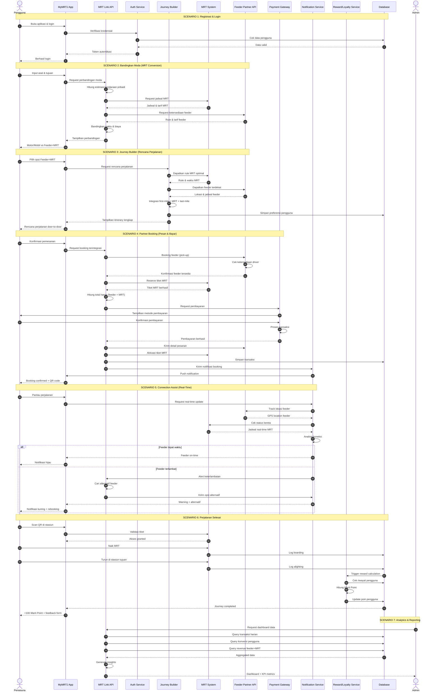

# MyMRTJ Ecosystem - Multimodal Sequence & System Architecture

[](https://abdhaamed.github.io/mrt-sequence/)
[](https://jakartamrt.co.id/)
[](https://lucide.dev/)
[](https://mermaid.js.org/)

Repositori ini memuat dokumentasi arsitektur dan **aplikasi visualizer interaktif sequence diagram** untuk sistem transportasi terpadu **MyMRTJ (MRT Jakarta)** yang mengintegrasikan moda transportasi utama kereta MRT dengan armada pengumpan (*first-mile & last-mile feeder*), sistem pembayaran tunggal (*single checkout*), asisten pemantauan perjalanan (*real-time connection assist*), program loyalitas *Marti Point*, dan analitik manajemen terpusat. Dilengkapi dengan antarmuka modern yang menggunakan **Tailwind CSS & Lucide SVG Icons** (bukan icon biasa/emoji bawaan).

🔗 **Akses Situs Web Interaktif (GitHub Pages):**  
👉 **[https://abdhaamed.github.io/mrt-sequence/](https://abdhaamed.github.io/mrt-sequence/)**

---

## Fitur Aplikasi Visualizer Web

- **Tab Navigasi Tiap Skenario**: Beralih antara diagram lengkap (*Master Overview*) dan 7 skenario spesifik secara terisolasi dengan icon Tailwind/Lucide tersendiri.
- **Simulator Transaksi Interaktif (Step-by-Step Walkthrough)**: Menelusuri alur pertukaran pesan antar-layanan langkah demi langkah, dilengkapi rute badge pengirim-penerima, penjelasan teknis (API payload, protokol komunikasi, status latensi, dan narasi aksi).
- **Pan & Zoom Canvas**: Kontrol penuh untuk memperbesar, memperkecil, mereset tampilan, dan mode layar penuh (*fullscreen*) menggunakan mouse scroll atau gesture sentuh.
- **Ekspor Diagram Vektor & Gambar**: Unduh sequence diagram langsung dalam format **SVG** (vektor tajam) atau **PNG** resolusi tinggi.
- **Salin Kode Mermaid**: Tombol 1-klik untuk menyalin kode Mermaid ke clipboard untuk keperluan dokumentasi atau presentasi.
- **Katalog Aktor & Microservice**: Rangkuman tanggung jawab teknis 12 entitas dalam ekosistem MyMRTJ dengan badge icon SVG kustom.

---

## Master Sequence Diagram

Diagram alur transaksi terpadu end-to-end MyMRTJ:



---

## Rincian 7 Skenario

### 1. Registrasi & Login
- **Aktor:** Pengguna, MyMRTJ App, Auth Service, Database
- **Tujuan:** Verifikasi identitas pengguna, validasi data pengguna pada database terpusat, dan penerbitan token sesi JWT (*JSON Web Token*) yang aman.

### 2. Bandingkan Moda (MRT Conversion)
- **Aktor:** Pengguna, MyMRTJ App, MRT Link API, MRT System, Feeder Partner API
- **Tujuan:** Membandingkan waktu tempuh, biaya moneter, serta jejak karbon antara kendaraan pribadi (motor/mobil) dengan kombinasi transportasi umum (Feeder + MRT) untuk mendorong *modal shift* ke MRT Jakarta.

### 3. Journey Builder (Rencana Perjalanan)
- **Aktor:** Pengguna, MyMRTJ App, Journey Builder, MRT System, Feeder Partner API, Database
- **Tujuan:** Menghitung rute multi-moda *door-to-door* yang optimal. Menggabungkan titik awal penjemputan (*first-mile*), jadwal transit kereta MRT, hingga rute akhir (*last-mile*) dan menyimpan preferensi rute pengguna.

### 4. Partner Booking (Pesan & Bayar Terpadu)
- **Aktor:** Pengguna, MyMRTJ App, MRT Link API, Feeder Partner API, MRT System, Payment Gateway, Database, Notification Service
- **Tujuan:** *Single checkout experience*—pengguna memesan armada jemputan feeder sekaligus tiket MRT dalam satu kali transaksi pembayaran. Setelah transaksi berhasil, tiket QR code dinamis langsung diterbitkan dan driver feeder diberangkatkan.

### 5. Connection Assist (Real-Time Monitoring)
- **Aktor:** Pengguna, MyMRTJ App, Notification Service, Feeder Partner API, MRT System, MRT Link API
- **Tujuan:** Asisten waktu nyata yang memonitor posisi GPS feeder dan ketepatan waktu kedatangan kereta MRT. Bila armada feeder terlambat akibat kemacetan, sistem secara proaktif mengirim peringatan dan menawarkan opsi pergantian jadwal kereta (*auto-rebooking*) tanpa biaya tambahan.

### 6. Perjalanan Selesai & Marti Point
- **Aktor:** Pengguna, MyMRTJ App, MRT System, Database, Reward/Loyalty Service
- **Tujuan:** Validasi tiket QR di gerbang (*gate in/out*) stasiun, pencatatan log *boarding* dan *alighting*, disusul oleh perhitungan otomatis poin loyalitas (*Marti Point*) dan survei kepuasan pelanggan.

### 7. Analytics & Reporting (Admin)
- **Aktor:** Admin / Manajemen Operasional, MRT Link API, Database
- **Tujuan:** Menyediakan dashboard analitik eksekutif untuk memantau performa harian operasional, rasio konversi kendaraan pribadi ke MRT, total pendapatan multi-moda, dan wawasan berbasis data.

---

## Katalog Komponen & Layanan

| Komponen / Aktor | Icon Tailwind / SVG | Peran & Tanggung Jawab Teknis |
|---|---|---|
| **Pengguna** | `user` | Penumpang yang mengakses aplikasi mobile MyMRTJ untuk merencanakan dan melakukan perjalanan. |
| **MyMRTJ App** | `smartphone` | Aplikasi mobile *client-side* (iOS/Android) yang menampilkan peta rute, tiket QR dinamis, dan status perjalanan langsung. |
| **MRT Link API** | `network` | API Gateway terpusat yang mengatur routing request, agregasi data antar microservice, dan integrasi mitra eksternal. |
| **Auth Service** | `shield-check` | Mengelola autentikasi berbasis token JWT, registrasi akun, verifikasi OTP/PIN, dan enkripsi kredensial. |
| **Journey Builder** | `navigation-2` | Mesin komputasi rute multimodal (*graph-routing engine*) yang memadukan titik jemput, transit, dan tujuan akhir. |
| **MRT System** | `train-track` | Sistem inti operasional MRT Jakarta: jadwal headway, *fare engine*, validasi gating stasiun, dan status armada kereta Ratangga. |
| **Feeder Partner API** | `bike` | Antarmuka integrasi mitra ride-hailing / mikromobilitas (ojol, bus pengumpan) untuk dispatch armada dan pelacakan GPS. |
| **Payment Gateway** | `credit-card` | Pemroses transaksi multi-metode (QRIS, e-Wallet, Kartu Kredit/Debit, Virtual Account) yang aman dan teruji. |
| **Notification Service** | `bell` | Layanan *push notification* (FCM/APNs) dan transmisi update real-time via WebSocket / SSE. |
| **Reward / Loyalty Service** | `gift` | Mesin gamifikasi pengelola kalkulasi Marti Point, cashback, kupon merchant, dan insentif pengurangan emisi karbon. |
| **Database Core** | `database` | Basis data relasional dan *time-series* untuk transaksi, riwayat perjalanan, ledger pembayaran, dan profil pengguna. |
| **Admin** | `user-cog` | Pengguna internal operasional dan analis bisnis yang memantau performa sistem melalui BI Dashboard. |

---

## Menjalankan Secara Lokal

Repositori ini dibuat dengan arsitektur web modern tanpa memerlukan proses kompilasi (*zero-build architecture*).

1. Clone repositori:
   ```bash
   git clone https://github.com/abdhaamed/mrt-sequence.git
   cd mrt-sequence
   ```

2. Jalankan server lokal:
   ```bash
   python -m http.server 8000
   ```

3. Buka browser di `http://localhost:8000`.

---

## Deployment

Situs web ini di-host langsung menggunakan **GitHub Pages**. Setiap perubahan pada branch `main` secara otomatis memicu pembaruan halaman publik melalui GitHub Actions:

- **URL Deployment:** [https://abdhaamed.github.io/mrt-sequence/](https://abdhaamed.github.io/mrt-sequence/)

---

© 2026 MyMRTJ Ecosystem Architecture. Dikembangkan untuk visualisasi sistem transportasi terintegrasi Jakarta.
